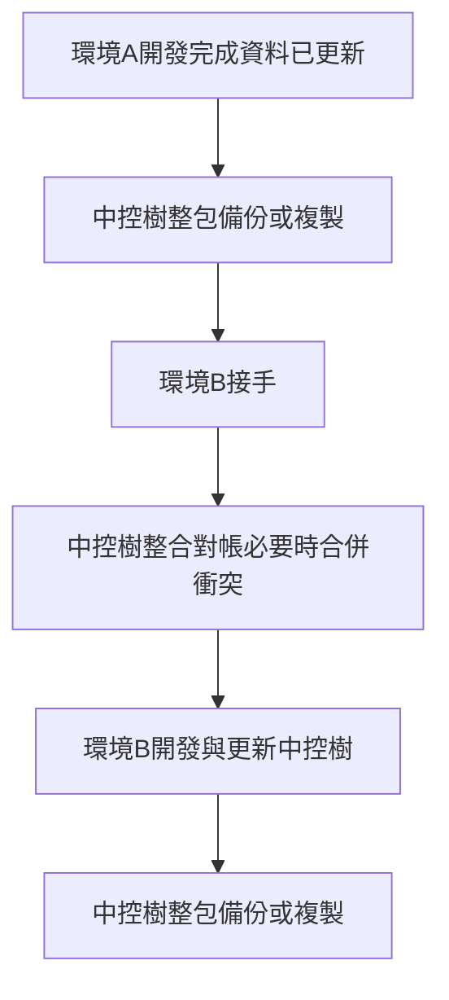
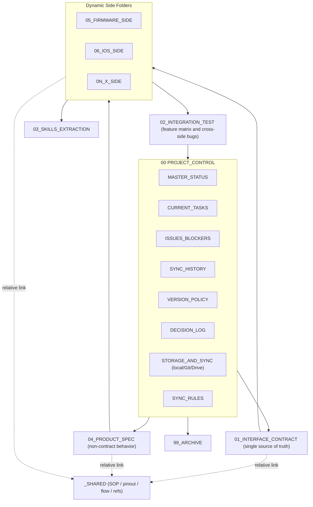

# 讓任何 AI、任何 OS、任何專案都能一起合作的「Control Tree（中控樹）」

> **正式名稱（中文）**：中控樹 · **英文名稱**：Control Tree。

> 一個跨平台、跨 AI、跨端的協作脈絡管理方法論 — Control Tree（中控樹）。

---

## 1. 為什麼會走到這一步

我在做一個叫 **EasyLighting** 的產品。一邊是 BLE 燈具的韌體（TI MCU、CCS 工程，跑在 Windows），另一邊是 iOS App（Swift、Xcode，跑在 Mac），未來還會接 Android。我在 Mac 上用 Cursor + Claude，在 Windows 上開另一個 Cursor + Codex，偶爾還用 Gemini 釐清概念。

問題很快就浮上來：

- **A 改了 BLE payload，B 不知道**。等到 iOS 燒到實機，才發現燈不亮。
- **換一個 AI 接手，前面的脈絡全部歸零**。我得從頭再講一次「韌體有哪些 MsgType、iOS 為什麼用 `A0 01`」。
- **本地、Google Drive、Git 三份檔案各自演化**，沒人說得清誰是真相。
- **誰欠誰、卡在哪、進度到哪**，永遠在 LINE / Slack 群組裡翻舊訊息找。

這不是「找一個更聰明的 AI」可以解決的。這是**協作脈絡的容器不對**。

所以我做了一棵叫 `EasyLighting_ControlTree` 的中控樹，把所有跨端脈絡寫成 md 檔，讓任何 AI 在任何環境讀完就能上工。用了一陣子之後，我發現這個骨架其實可以脫離韌體／App 的特定情境，**通用化成任何專案都能用**。這就是這篇文章要講的 **Control Tree（中控樹）**。

---

## 2. 核心觀念三句話

### 2.1 Sync as Files — 脈絡是檔案，不是某一個 AI 的記憶

AI 的記憶是**易揮發的**。Cursor 開新對話就忘、Claude 換版就忘、ChatGPT 重啟 session 就忘。所以協作脈絡**不能放在 AI 裡**，要落到磁碟上的 md 檔。

只要落到檔案，任何 AI 都能讀；換 AI 不會斷脈絡；多 AI 並行也能對帳。

### 2.2 核心固定、端別動態、儲存可換

中控樹有 **六個數字編號的固定核心資料夾**（`00`–`01`、`02`–`04`、`99`），跨專案都一樣：

- `00_PROJECT_CONTROL/` 儀表板
- `01_INTERFACE_CONTRACT/` 跨端介面的單一真相
- `02_INTEGRATION_TEST/` 跨端對帳與測試
- `03_SKILLS_EXTRACTION/` 可重用的 AI 知識
- `04_PRODUCT_SPEC/` 非介面之產品／流程／商業規則
- `99_ARCHIVE/` 封存

外加一個底線開頭的特殊資料夾 `_SHARED/`，用來放「全專案 AI 都該知道」的共用文件（後面 §3.5 詳述）。

「端別」是動態的，由使用者宣告。可以是 `firmware / ios / android`，也可以是 `web / cloud / hardware`，甚至 `mechanical / factory`。每個端是一個 `0X_<SIDE>_SIDE/` 資料夾（**X 從 05 起**：第 1 個端 `05_<SIDE>_SIDE`、第 2 個 `06_<SIDE>_SIDE` … 至 `98` 止），裡面 5 隻檔案：

- `<SIDE>_STATUS.md` — 現況
- `<SIDE>_AI_HANDOFF.md` — 給下一隻 AI 的交接書
- `<SIDE>_CHANGELOG.md` — 版本／變更紀錄
- `<SIDE>_TEST_LOG.md` — 測試紀錄
- `<SIDE>_SKILL_NOTES.md` — 該端的私房知識

儲存後端三選一：

- `local` — 純本地，最簡單，單人單機 OK
- `git` — commit / push / pull，多人協作好用、有 CI
- `cloud-drive` — Google Drive / OneDrive / iCloud / Dropbox / NAS，非工程角色也能改

可以中途換。

### 2.3 預設：整棵樹（含 `_SHARED/`）都是本機檔案

**你不必為 `_SHARED/` 再選一種「第二套儲存策略」。** 共用資料夾與 `00`～`99` 一樣，就是磁碟上的普通檔案；預設情境就是「跟你的專案程式碼在同一台機器、同一套備份習慣」。

要把中控樹搬到另一台電腦（Mac ↔ Windows ↔ Linux）時，**預設作法是整包資料夾備份／複製**（務必包含 `_SHARED/`，不要只拷 md）。覺得手動複製麻煩，再把整棵樹丟進 Git repo 或雲端硬碟同步資料夾即可 — 那是**整棵樹**的儲存後端切換，不是 `_SHARED/` 獨立一套。

### 2.4 多環境交接：簡易流程（本機為主）

典型是「家裡 Mac 寫 App、公司 Windows 弄韌體」這種**同一個人、兩台機器**。你不需要先架 CI；照下面迴圈跑就夠：



- **備份／複製**：zip、隨身碟、NAS、手動整夾複製皆可；重點是**整包**（含 `_SHARED/` 與 `control-tree.config.yml`）。
- **整合**：在環境 B 打開後先讀 `MASTER_STATUS.md`、`SYNC_HISTORY.md`、`_SHARED/README.md`；若兩邊都改過同一檔，用 diff 合併或把衝突檔丟進 `99_ARCHIVE/` 再裁決（細節見中控樹內 `SYNC_RULES.md`）。
- **若已改用 Git 或雲端**：中間「備份／複製」多半變成 `push`／`pull` 或「等雲端同步完成」，流程圖形狀不變，只是傳輸機制換掉。

### 2.5 任何 AI、任何 OS

中控樹**只是純 md**（外加 `_SHARED/` 裡你放的圖／PDF）。任何能讀文字的 AI 都能用 — Cursor、Claude、Gemini、ChatGPT、Codex，新一代 AI 來了還是能用。Mac / Windows / Linux 沒差別，因為 md 是純文字。

### 2.6 實務上五件「架構有接住」的事

下面五點是許多人採用中控樹時的**核心動機**；目錄不是為了好看，而是對應這些用途。

#### 2.6.1 較適合一人專案（一人多 AI）

預設場景是**同一個人**同時用多種 AI、多種工具鏈；樹裡不強制 RACI、PR、會議紀錄那套「多人組織」配件（見 §8）。`00_PROJECT_CONTROL/` 當你的外接儀表板，成本主要在「寫檔」而不是「開一堆 SaaS」。

#### 2.6.2 透過中控樹與 AI，跨 Windows / macOS / Linux 協作

脈絡在**檔案**裡，不在某一個 OS 或某一個 IDE。你在 A 環境請 AI 更新 md，把整棵樹（含 `control-tree.config.yml`、`_SHARED/`）依 §2.3、§2.4 搬到 B 環境後，另一個 AI 讀同一批檔就能接棒 — 等於用**同一份樹**在異質 OS 之間對帳，而不是靠聊天視窗複製貼上。

#### 2.6.3 透過中控樹與 AI，串起不同「產品形態」的工作

「端別」不限韌體／App／雲端：行銷**文案**、硬體機構／試產、視覺與包裝、營運**計畫**與里程碑，都可以宣告成 `05_` 起的 `<SIDE>_SIDE/`，把狀態與交接寫在該端的五隻檔案裡；不涉及跨端通訊契約的敘事則收斂在 `04_PRODUCT_SPEC/`。跨端或對外的介面仍由 `01_INTERFACE_CONTRACT/` 當單一真相；附件進 `_SHARED/`。這樣**軟體、硬體、文案、計畫**能在同一棵樹裡被不同 AI 讀寫而不混成單一長聊天。

#### 2.6.4 不同 AI、不同機器並行（例：Windows 本機模型、Mac 上 Claude Code、Linux 上 Cursor）

`Last Updated By` 標模型與工具（見 §5），同一檔可能被不同品牌的 AI 接續編輯；重點是**先讀後寫**、寫完更新 `SYNC_HISTORY` / `MASTER_STATUS`。實務上常見組合是：開發者在 **Windows** 用內網或本機推理服務、在 **Mac** 用 **Claude Code**、在 **Linux** 用 **Cursor** — 三者不必共用同一個帳號或同一個雲端產品，只要它們都能讀寫你選定的儲存後端上的**同一棵中控樹**即可。

#### 2.6.5 專案或子專案告一段落後：把經驗收成 SKILLS

進行中時，各端可把「這台／這條 build 才會踩到的雷」記在 `0X_<SIDE>_SIDE/<SIDE>_SKILL_NOTES.md`。**封館、釋出、或某子軸結案**時，再把**跨端可重用**的套路、除錯路徑、domain 知識整理進 `03_SKILLS_EXTRACTION/`（例：`DOMAIN_<topic>.md`、`BUG_FIX_<topic>.md`），必要時再匯出成你慣用的 AI Skill 檔或內部 playbook，帶進下一個專案 — 中控樹變成「經驗的停車場」，而不是結案即丟的對話紀錄。

---

## 3. 共用文件中心：`_SHARED/` 一個地方解決全部

實際做專案時你會發現，**真正讓人迷路的不是規格本身**，而是那些「我知道有，但不知道在哪」的東西：

- 韌體腳位設定圖（PNG / Visio / KiCad 截圖）
- 軟體 release SOP
- 客戶來的需求 PDF
- IC datasheet
- 品牌色卡、Logo、UI guideline
- 跨模組的時序圖、狀態機
- 註冊表 CSV、腳位分配 Excel

這些東西**不該分散**在每個資料夾裡，否則改一份要找十處。也**不該硬塞**到某個規格 md 裡，否則每個 md 都長得像論文。

Control Tree（中控樹） 的做法很乾脆：**全部丟 `_SHARED/`**，**單一位置，不複製**。

### 3.1 用法只有三條規則

1. **使用者只往一個地方丟**：要全專案 AI 知道的東西 → `_SHARED/` 根目錄。要不要分子資料夾自己決定，預設可以平鋪。
2. **其他 md 想用就用相對連結**：例 ``、`[燒錄 SOP](../_SHARED/sop_firmware_flash.md)`。**禁止複製檔案到別處**。
3. **索引維護**：`_SHARED/README.md` 有一張索引表，AI 每次動 `_SHARED/` 時順手更新。動手前掃一眼這張表就知道有什麼資源可用。

### 3.2 為什麼底線開頭（`_SHARED/` 而非 `08_SHARED/`）

- 底線在 Mac Finder / Windows 檔案總管 / VS Code 都會被**排到最下面**，視覺上跟「核心 6 個編號資料夾」分離。
- 編號是「規格／真相層」；底線開頭是「附件／資產層」。**層級不同，編號就不該混。**
- 跟 `_SIDE/` 模板資料夾的命名一致（雖然 `_SIDE/` 只存在於 INIT 包的 TEMPLATES，不在實際中控樹）。

### 3.3 跟「規格 md」的分工

| 你想放的東西 | 放哪 |
|---|---|
| 規格本文（會被 AI 引用為決策依據） | `01_INTERFACE_CONTRACT/` 或 `04_PRODUCT_SPEC/` |
| 規格附件（圖、PDF、外部 datasheet） | `_SHARED/` |
| 某一端的私房筆記 | `0X_<SIDE>_SIDE/<SIDE>_SKILL_NOTES.md` |
| 跨端可重用的 AI 知識 | `03_SKILLS_EXTRACTION/` |
| 跨端議題、待辦、bug | `00_PROJECT_CONTROL/` 或 `02_INTEGRATION_TEST/` |
| 已淘汰的舊版資產 | `99_ARCHIVE/` |

只要遵守「**規格在 md、附件在 `_SHARED/`、引用用連結**」這個三句口訣，整棵樹永遠井然有序。

**儲存**：`_SHARED/` 不另開儲存模式；與整棵中控樹一樣預設在本機，換機用整包複製或（可選）Git／雲端 — 見上文 §2.3、§2.4。

---

## 4. 四軸版本：把「現在到底是哪個版本」講清楚

很多專案壞在這裡：**只有一個版本軸**，把「規格版本」「實作版本」「中控檔自己的版本」全攪一起，最後沒有人講得清狀態。

Control Tree（中控樹） 拆成四軸：

| 軸 | 用途 | 範例 |
|---|---|---|
| `SYNC_REV` | 中控樹**本身**的版本（每次改檔都加一） | `2026.05.14-001` |
| `CONTRACT_VERSION` | **跨端介面**的版本（BLE / API / Protocol） | `v0.1.0` |
| `SIDE_VERSION` | **各端實作**的版本 | `FW-1.2.3` / `IOS-1.0.0` |
| `PRODUCT_SPEC_VERSION` | **非介面**之產品／流程／商業規則版本 | `v0.1.0` |

每次更新中控樹時 AI 自問：

- 這次改有沒有牽動 `CONTRACT_VERSION`？
- 有沒有牽動某個 `SIDE_VERSION`？
- 有沒有牽動 `PRODUCT_SPEC_VERSION`？
- `SYNC_REV` 一定要加一。

這四軸獨立後，狀態突然就講得清了：「iOS 1.0.0 支援 Contract v0.1.0；韌體 FW-1.2.3 已實作但**未驗證**支援 Contract v0.2.0」。

---

## 5. 換一個 AI 也接得上：跨 AI 對帳協議

每個 md 表頭都標 `Last Updated By` 與 `Last Updated At`，且 `Last Updated By` 要寫**模型名稱**，例如：

- `Cursor (Claude Opus 4.7)`
- `Gemini 2.5 Pro`
- `ChatGPT-5`
- `Codex CLI`

這樣後續任何 AI 接手時，能知道**上一筆是誰改的**，不會把對方的變更誤判為錯誤直接覆蓋。

而且訪談答案會同時寫進 `control-tree.config.yml` — 一份統一的設定檔。下一個 AI 進來直接讀這份 yml，**不必重訪談**。

---

## 6. 一張圖：整棵樹怎麼動



讀順序（任何 AI 動手前）：

```
README → MASTER_STATUS → SYNC_RULES → STORAGE_AND_SYNC
→ _SHARED/README.md  →  CURRENT_TASKS
→（任務相關）INTERFACE_SPEC / <SIDE>_STATUS / FEATURE_MATRIX
```

寫順序（任何 AI 動手後）：

```
<SIDE>_STATUS → <SIDE>_CHANGELOG → FEATURE_MATRIX → CURRENT_TASKS
→（如有議題）ISSUES_BLOCKERS  →（若新增共用文件）_SHARED/README.md 索引
→ SYNC_HISTORY → MASTER_STATUS（含 SYNC_REV +1）
```

---

## 7. 怎麼起步：把 INIT.md 丟給 AI

任何使用者只需要做一件事 — 把這段話貼給任何一個 AI：

```
請依 https://raw.githubusercontent.com/GGeggsong/ControlTree/main/INIT.md
執行 Control Tree（中控樹）建樹流程。
我的本地專案根目錄是 <C:\path\to\project>。
我想使用 <local | git | cloud-drive> 作為儲存後端。
```

接下來 AI 會：

1. 讀 `INIT.md`
2. 讀 `BOOTSTRAP/05_FILL_RULES.md`（硬性規則）
3. 跟你做 6 題訪談（專案名、路徑、協作分支、多分支共用規格有無、儲存後端、版本——最後一題**一句話**確認起頭版，不對使用者轟術語）
4. 依 `BOOTSTRAP/02_BUILD_TREE.md` 建出整棵樹
5. 從 `BOOTSTRAP/TEMPLATES/` 拷貝模板、替換占位符
6. 依 `BOOTSTRAP/03_STORAGE_PRESETS.md` 寫好 `STORAGE_AND_SYNC.md`
7. 把訪談答案存成 `control-tree.config.yml`
8. 復述摘要給你確認

整個流程 **5 ~ 10 分鐘**完成。沒有 CLI、沒有 npm install、沒有 Docker，純對話。

---

## 8. 為什麼這套是「一人多 AI」優化，不是「大公司協作」

這是設計取捨。Control Tree（中控樹）的目標使用者是**一個人 + 多隻 AI**：

- 你白天在 Mac 開 Cursor + Claude 寫 iOS
- 晚上跳到 Windows 開另一個 Cursor + Codex 弄韌體
- 偶爾打開瀏覽器用 Gemini 釐清概念
- 雲端硬碟把這些都自動同步

這個場景的特性跟「五十人團隊」完全不同：

| 一人多 AI（本工具場景） | 五十人團隊（典型企業協作） |
|---|---|
| 沒有人會搶你的檔，只有 AI 偶爾覆蓋自己上次寫的東西 | 高度並行，需要 lock、PR、review、CI |
| 一個人記憶有限，**所以需要 Control Tree（中控樹）當外腦** | 已經有 Jira、Confluence、Notion、Slack 在分工 |
| 重點是「不要重訪談、不要重講脈絡」 | 重點是「不要互相踩線」 |
| 角色（PM／RD／QA／PO／PM／Designer）你一個人全包，不需要 RACI 表 | 需要 RACI、需要會議紀錄、需要簽核 |

所以這套 INIT 包**故意省略**以下這些東西：

- **不**內建 PR 模板、code review checklist
- **不**內建會議紀錄資料夾、議程模板
- **不**內建 RACI 表、角色責任表
- **不**強制 commit message 規範（但 `git` 後端的 SOP 有建議）
- **不**內建多人同時編輯的 lock 機制（雲端硬碟用內建衝突偵測就夠）

AI 在建樹時也**被明確要求不要塞**這些東西進來（見 `BOOTSTRAP/05_FILL_RULES.md` R13）。

### 「以後變團隊用」怎麼辦？

這套結構天生**向上相容**團隊用：

- 儲存後端切到 `git` → 有 PR / merge / CI
- 在 `_SHARED/` 加 `sop/review_process.md`、`sop/release_process.md` → 流程化
- `00_PROJECT_CONTROL/CURRENT_TASKS.md` 加上 `Owner` 欄 → 分工
- 加一個 `_TEAM/` 資料夾放會議紀錄、角色表 → 不污染原本核心

不過絕大多數情境下，這些都是**真正需要的時候再加**。預設不背這些包袱，是因為**一人專案的最大成本是「啟動阻力」**，不是「協作摩擦」。背太多包袱，你會懶得用。

---

## 9. 真實案例：EasyLighting 的長相

我自己的 `EasyLighting_ControlTree` 跑了幾個月，骨架幾乎沒動，只長出新內容。`FEATURE_MATRIX.md` 大致長這樣（節錄）：

```
| Feature                  | Firmware | iOS         | Android      | Integration              | Next Owner |
|---|---|---|---|---|---|
| BLE Advertising          | Partial  | Partial     | Need Verify  | Need Verify              | Both       |
| Brightness Control 0x10  | Partial  | Implemented | Need Verify  | Waiting Integration Test | User       |
| 群組控燈 0x11             | Partial  | Not Started | Need Verify  | Waiting iOS              | iOS Cursor |
| 定時器 0x20/0x21/0x50     | Partial  | Not Started | Need Verify  | Waiting iOS              | iOS Cursor |
| 設定密碼 0x30             | Partial  | Not Started | Need Verify  | Waiting iOS              | iOS Cursor |
| 重置裝置 0x70             | Partial  | Need Verify | Need Verify  | Contract Pending         | Firmware   |
```

哪個 AI 都看得懂這張表 — 誰已經做、誰還沒做、誰要等對方、誰要 User 排測試。

換 AI 時，新 AI 進來讀 `MASTER_STATUS.md`、`FEATURE_MATRIX.md`、`<SIDE>_STATUS.md`，5 分鐘就能上工，**不必重訓**任何上下文。

---

## 10. 開始用

1. 到 GitHub 開 [Control Tree（中控樹）](https://github.com/GGeggsong/ControlTree) 倉庫（clone：`https://github.com/GGeggsong/ControlTree.git`）。
2. 把 `INIT.md` 的 raw URL 給任何一個你信任的 AI。
3. 5 ~ 10 分鐘後，你有一棵能跨平台、跨 AI、跨端的中控樹。
4. 把你的 SOP、腳位圖、流程圖、規範丟進 `_SHARED/`，剩下的 AI 會自己找到。

無需安裝、無需訂閱、無需綁某個 AI 廠商。你的脈絡是你的檔案，你的版本是你的版本，你的協作節律由 md 決定，不由 AI 公司決定。

---

*作者：Stark Song · 2026-05-14*
